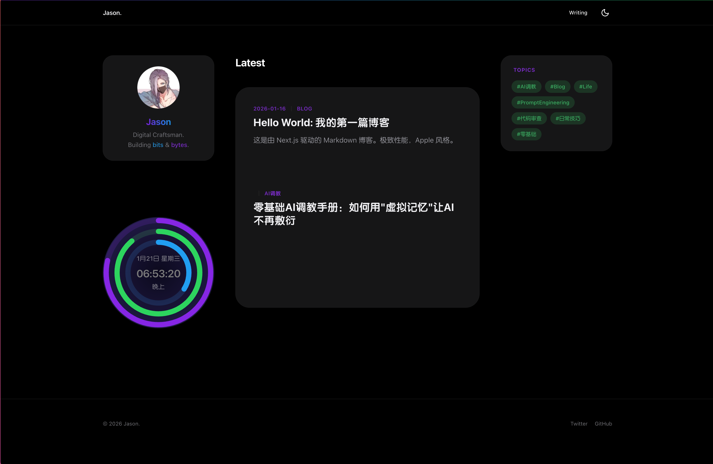
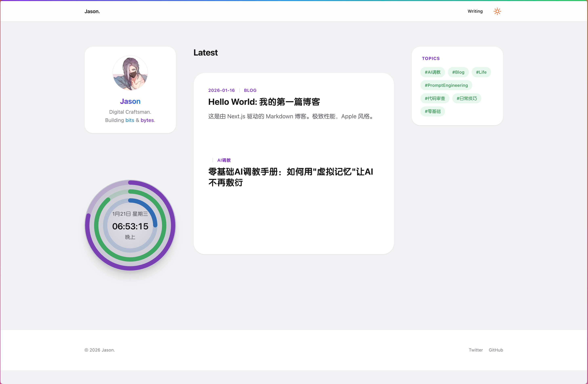

[English](#english) | [简体中文](#简体中文)

---

# Apple Portfolio Lite (个人博客)

一个极简风格的个人博客，Apple 设计语言，基于 Next.js 16 构建。

  

## 预览

| 深色模式 | 浅色模式 |
|:--------:|:--------:|
|  |  |

## 特性

- 🎨 **Apple 设计风格** - 暗色主题、毛玻璃效果、圆角卡片
- ⚡ **极速性能** - Next.js App Router + React 19
- 🌓 **深色模式** - 自动跟随系统，支持手动切换
- ⌚ **活动圆环时钟** - Apple Watch 风格的动态时钟组件
- 📝 **Markdown 博客** - 使用 gray-matter 解析 frontmatter
- 🐳 **Docker 支持** - 一键自托管部署

## 快速开始

### 本地开发

```bash
# 克隆项目
git clone https://github.com/jasonlau111/apple-portfolio-lite.git
cd apple-portfolio-lite

# 安装依赖
npm install

# 启动开发服务器
npm run dev
```

打开 [http://localhost:3000](http://localhost:3000) 查看效果。

### Docker 部署

```bash
docker-compose up -d
```

### Vercel 部署（推荐）

[](https://vercel.com/new/clone?repository-url=https://github.com/jasonlau111/apple-portfolio-lite)

## 项目结构

```
├── app/                  # Next.js App Router
│   ├── components/       # React 组件
│   │   ├── ActivityClock.tsx   # 活动圆环时钟
│   │   ├── ProfileCard.tsx     # 个人资料卡片
│   │   └── ...
│   └── blog/             # 博客页面
├── content/              # Markdown 文章
├── public/               # 静态资源
└── docker-compose.yml    # Docker 配置
```

## 自定义

### 修改个人信息

编辑 `app/components/ProfileCard.tsx` 中的姓名和简介。

### 添加文章

在 `content/` 目录下创建 `.md` 文件：

```markdown
---
title: "文章标题"
date: "2026-01-21"
description: "文章描述"
tags: ["标签1", "标签2"]
---

正文内容...
```

## 技术栈

- [Next.js 16](https://nextjs.org/) - React 框架
- [React 19](https://react.dev/) - UI 库
- [Tailwind CSS](https://tailwindcss.com/) - 样式
- [Framer Motion](https://www.framer.com/motion/) - 动画
- [next-themes](https://github.com/pacocoursey/next-themes) - 主题切换

## 许可证

MIT

---

<a name="english"></a>

# English

A minimalist personal blog with Apple design language, built with Next.js 16.

## Features

- 🎨 **Apple Design** - Dark theme, glassmorphism, rounded cards
- ⚡ **Blazing Fast** - Next.js App Router + React 19
- 🌓 **Dark Mode** - System-aware with manual toggle
- ⌚ **Activity Clock** - Apple Watch style animated clock
- 📝 **Markdown Blog** - Frontmatter parsing with gray-matter
- 🐳 **Docker Ready** - One-command self-hosting

## Quick Start

```bash
git clone https://github.com/jasonlau111/apple-portfolio-lite.git
cd apple-portfolio-lite
npm install
npm run dev
```

## Deploy

### Vercel (Recommended)

[](https://vercel.com/new/clone?repository-url=https://github.com/jasonlau111/apple-portfolio-lite)

### Docker

```bash
docker-compose up -d
```

## License

MIT
