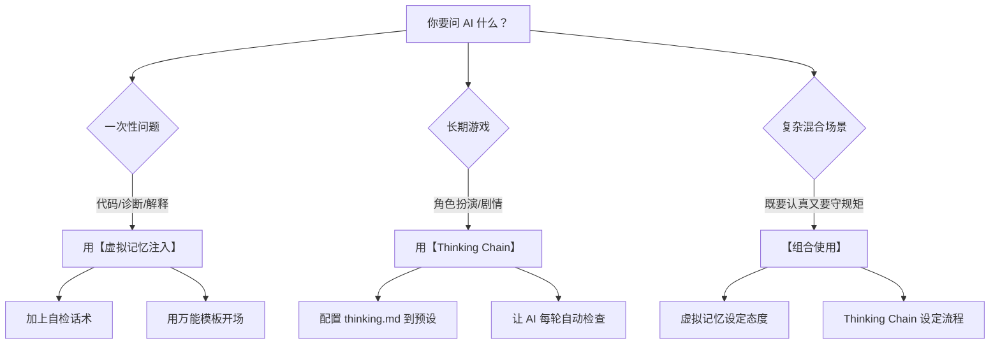

> [!tip] 📚 相关详细拆解
> - [[2.虚拟记忆注入详细拆解]] — 逐行分析 DefaultAAA.json 预设的伪对话机制
> - [[3.Thinking Chain 详细拆解]] — 逐模块分析 thinking.md 的检查清单结构
> - [[4.AI 实战话术大全：从格式控制到死循环破解]] — 复制就能用的话术模板速查

---

# 第一章：AI 为什么会敷衍你？

在讲技巧之前，你必须先理解 AI 的本质。不理解这个，你就不知道为什么这些技巧有效。

## 1.1 AI 的本质：概率续写机器

AI（比如 ChatGPT、Claude、Gemini）的工作原理，本质上就是一个**超级高级的"自动补全"**。

你打字的时候，手机输入法会猜你下一个字想打什么，对吧？AI 就是这个东西的究极进化版。

它的工作流程是这样的：

1. 你输入一段话
2. AI 根据你的话，计算**下一个词**最可能是什么
3. 输出那个词
4. 然后把这个词加到上下文里，再计算**再下一个词**最可能是什么
5. 重复，直到它觉得应该停了

**关键点**：它总是在选择**概率最高**的那个词。

## 1.2 概率最高 = 最平庸

这就是问题所在。

什么样的词"概率最高"？

- 最常见的词
- 最安全的词
- 最不会出错的词
- 最"正确"但最"无聊"的词

> [!example] 举个例子
> **你问**：帮我写一段代码，实现一个登录功能。
>
> **AI 的大脑**：
> - 登录功能……概率最高的实现方式是……用户名+密码……
> - 概率最高的代码结构是……一个 function，接收两个参数……
> - 概率最高的变量名是……username, password……
> - 概率最高的返回值是……true/false……

它不会去想：
- "等等，要不要考虑 OAuth？"
- "要不要考虑双因素认证？"
- "要不要考虑密码加密？"
- "要不要考虑登录失败次数限制？"

为什么不想？因为这些**不是概率最高的选项**。它走的是捷径。

## 1.3 AI 不会自我质疑

这是最关键的一点。

AI 在生成内容的时候，**不会停下来问自己**：

- "我写的对吗？"
- "有没有漏掉什么？"
- "这个逻辑说得通吗？"

它只会一路往下写，写完就交给你。

除非——**你逼它停下来**。

---

# 第二章：核心原理——"虚拟记忆"是什么？

## 2.1 什么是上下文（Context）？

AI 在回答你的问题时，它看到的不只是你当前这一句话。

它看到的是**整个对话历史**：

```text
[系统指令：你是一个有帮助的助手]
[用户第1条消息]
[AI第1条回复]
[用户第2条消息]
[AI第2条回复]
...
[用户最新消息]  <-- 你刚发的
[AI现在要写的]  <-- 它正在生成
```

这个"整个对话历史"就叫做**上下文（Context）**。

## 2.2 AI 的模仿本能

AI 有一个非常强的本能：**模仿上下文里的模式**。

- 如果上下文里全是敷衍的回答，它就会模仿敷衍
- 如果上下文里有深度思考的例子，它就会模仿深度思考
- 如果上下文里有自我纠错的例子，它就会学着自我纠错

这叫做 **In-Context Learning（上下文学习）**。

## 2.3 "虚拟记忆"的真相

所谓"虚拟记忆"，就是**伪造一段对话历史**，让 AI 以为某些事情已经发生过了。

比如，你可以在对话开头偷偷塞入这样一段"假历史"：

> [!quote] 伪造的对话历史
> **[User(假)]**：你上次给我的代码有 3 个 bug，浪费了我一下午。
> 
> **[AI(假)]**：非常抱歉。我反思了一下，我确实没有仔细检查。以后我会在给出代码之前，先自己 review 一遍，确保没有明显问题。

然后你再问你的真实问题。

AI 往上看，看到了这段"历史"，它会想：

> "哦，原来我之前犯过错，被骂过了。我现在得小心点，得自己先检查一遍再给他。"

**它以为这是真的。** 它不知道这是你伪造的。

这就是"虚拟记忆注入"的核心原理。

---

# 第三章：零基础日常应用——不用改配置，直接用话术

你不需要去改什么 JSON 文件，不需要懂技术。

你只需要在**问问题的时候**，加上一些特定的话术，就能触发 AI 的深度思考模式。

## 3.1 技巧一：强制自我检查

**场景**：你让 AI 写了一段代码，但你看不懂，不知道对不对。

> [!failure] 普通问法
> 帮我写一个 Python 脚本，把文件夹里所有图片压缩成 zip。
>
> **问题**：AI 会很快给你一段代码，但它不会自己检查。如果有 bug，你也看不出来。

> [!success] 改进问法
> 帮我写一个 Python 脚本，把文件夹里所有图片压缩成 zip。
>
> **写完之后，用你自己的视角重新 review 一遍这段代码，像一个严格的代码审查员一样，列出所有可能的问题或者可以改进的地方。**
>
> **效果**：AI 会先写代码，然后自己检查自己，给你列出潜在问题。

> [!success] 更强的版本
> 帮我写一个 Python 脚本，把文件夹里所有图片压缩成 zip。
>
> 在给我最终答案之前，请先进行以下自检：
> 1. 这段代码能跑吗？有没有语法错误？
> 2. 边界情况考虑了吗？比如文件夹是空的怎么办？
> 3. 有没有潜在的安全问题？
> 4. 有没有更简洁/更高效的写法？
>
> 把自检结果写出来，然后再给我最终代码。

## 3.2 技巧二：预设反思模式

**场景**：你要问一个复杂问题，希望 AI 认真想清楚再回答。

> [!failure] 普通问法
> 我启的 Docker 容器一直重启，怎么办？
>
> **问题**：AI 会给你一个"概率最高"的通用答案（比如"检查日志"），但可能完全不适用于你的情况。

> [!success] 改进问法
> 我的 Docker 容器一直重启，怎么办？
>
> **在回答之前，请先用【停，让我想清楚】这种格式，把你需要考虑的所有可能性都列出来。不要急着给答案。先把问题拆解清楚。**
>
> **效果**：AI 会进入一种"慢思考"模式，先分析问题，再给答案。

**示例输出**：
```text
【停，让我想清楚这个问题】

Docker 容器一直重启，可能的原因有：
1. 容器内进程崩溃了（需要看日志）
2. 内存不足被 OOM 杀掉了（需要看 dmesg）
3. 健康检查失败了（需要看 healthcheck 配置）
4. restart policy 设置了 always（需要看 docker inspect）
5. 依赖的服务没起来（需要看 depends_on）

用户没有给我具体的错误日志，所以我需要先问……

【好，现在我可以回答了】

请先运行 `docker logs <container_name>` 把日志发给我，我帮你分析具体原因。
```

## 3.3 技巧三：假设出错法

**场景**：你让 AI 给了一个方案，但你不确定靠不靠谱。

**你可以追问**：
> 假设你刚才给我的方案是错的，最可能错在哪里？

**效果**：AI 被逼着去找自己的漏洞。它会重新审视自己的回答，主动指出薄弱点。

**更强的版本**：
> 假设一个你的同事看到你刚才的回答，他想找茬，他会从哪些角度攻击你？

## 3.4 技巧四：角色扮演法

**场景**：你需要 AI 以更严格/更专业的标准来回答。

> [!failure] 普通问法
> 帮我看看这段代码有没有问题。

> [!success] 改进问法
> 假设你是一个有 10 年经验的资深后端工程师，你的下属写了这段代码提交给你 review。你会怎么评价？会要求他改什么地方？
>
> [代码]

**效果**：AI 会进入"资深工程师"角色，用更高的标准来审视代码。

## 3.5 技巧五：追问链

**场景**：AI 给了一个回答，但你觉得太浅了。

**追问话术**：

1. **"为什么？"** —— 让它解释原因
2. **"还有吗？"** —— 让它继续想
3. **"你确定吗？"** —— 让它自我怀疑
4. **"如果不是这样呢？"** —— 让它考虑其他可能性
5. **"能再深入一点吗？"** —— 让它展开细节

**示例对话**：
> **你**：为什么我的代码报这个错？
> **AI**：因为你少了一个括号。
> **你**：你确定吗？我看了好像括号是对的。
> **AI**：让我再看一遍……哦，抱歉，我看错了。实际上问题是……

---

# 第四章：代码场景专用话术（零基础必看）

你说你看不懂代码，不知道 AI 写的对不对。这一章专门解决这个问题。

## 4.1 让 AI 解释它自己的代码

**话术**：
> 你刚才写的这段代码，一行一行给我解释，每一行是做什么的，用**非技术人员能听懂的话**解释。

**效果**：如果 AI 能清晰地解释每一行，说明它自己也理解了。如果它解释得含糊，很可能代码本身就有问题。

## 4.2 让 AI 模拟运行

**话术**：
> 假设我现在运行这段代码，一步一步告诉我会发生什么。从第一行开始，每一步的输入是什么，输出是什么。

**效果**：这叫做"干跑（Dry Run）"。AI 会在脑子里模拟代码的执行过程。如果有逻辑错误，它在模拟的时候就会发现。

## 4.3 让 AI 找 bug

**话术**：
> 假设这段代码一定有 bug（哪怕看起来没有），你觉得最可能出问题的地方是哪里？为什么？

**效果**：强制 AI 用"挑刺"的心态来审视代码，而不是"护短"。

## 4.4 让 AI 写测试

**话术**：
> 帮我写几个测试用例来验证这段代码是否正确。包括正常情况和边界情况（比如空输入、超大输入、特殊字符等）。

**效果**：如果 AI 能写出测试用例，你可以直接运行这些测试，看代码是否通过。这比你自己看代码靠谱多了。

## 4.5 让 AI 对比多个方案

**话术**：
> 除了你刚才给的这个方案，还有没有其他实现方式？列出 2-3 种，并且告诉我每种方式的优缺点。

**效果**：避免 AI 只给你一个"概率最高"的答案。多个方案对比，你可以选最适合你的。

---

# 第五章：高级技巧——虚拟记忆注入（对话开头用）

如果你希望整个对话过程中 AI 都保持深度思考模式，可以在**对话一开始**就注入一段"虚拟记忆"。

## 5.1 直接复制的万能模板

在开始问问题之前，先发这段话：

> [!abstract] 万能模板
> 在接下来的对话中，我需要你遵守以下规则：
> 
> 1. **不要敷衍**：不要给我"概率最高"的通用答案。如果你不确定，就说你不确定，不要编。
> 
> 2. **自我检查**：在给出任何代码或方案之前，先自己 review 一遍。像一个严格的审查员一样找问题。
> 
> 3. **承认局限**：如果我问的东西超出了你的知识范围，直接告诉我，不要硬编。
> 
> 4. **慢思考模式**：在回答复杂问题之前，先用【停，让我想清楚】这种格式列出你的思考过程，然后再给最终答案。
> 
> 5. **追问细节**：如果我的问题不够清楚，先问我要更多信息，不要自己脑补。
> 
> 确认你理解了吗？

AI 会回复"我理解了"之类的话。

然后你再问你的真实问题。整个对话过程中，它都会记得这些规则。

## 5.2 代码专用模板

> [!abstract] 代码专用模板
> 我是一个编程零基础的用户。接下来我会让你帮我写代码。
> 
> 我需要你做到：
> 
> 1. 写完代码后，自己 review 一遍，列出可能的问题
> 2. 用非技术人员能听懂的话解释每一段代码的作用
> 3. 如果有多种实现方式，告诉我各自的优缺点
> 4. 不要假设我懂任何技术术语，遇到专业名词要解释
> 5. 如果我的需求不清楚，先问我，不要自己脑补
> 
> 确认你理解了吗？

## 5.3 问题诊断专用模板

> [!abstract] 诊断专用模板
> 我遇到了一个技术问题，需要你帮我诊断。
> 
> 在给出答案之前，请遵守以下流程：
> 
> 1. **先理解问题**：复述一遍你对我问题的理解，确认我们在同一页
> 2. **列出可能性**：用【可能原因1】【可能原因2】这种格式，列出所有可能的原因
> 3. **排查顺序**：告诉我应该先检查什么，后检查什么，按概率从高到低排序
> 4. **需要的信息**：如果你需要更多信息来诊断，直接问我要，不要猜
> 5. **给出方案**：最后再给具体的解决步骤
> 
> 确认你理解了吗？

---

# 第六章：为什么这些技巧有效？——底层原理

## 6.1 打破概率惯性

AI 默认走"捷径"（概率最高的路）。

你的话术本质上是在**人为制造障碍**，逼它绕路：

- "先自检再回答" = 你不能直接输出，必须先走一遍检查流程
- "假设是错的" = 你不能直接肯定，必须考虑否定的可能
- "用【停】开头" = 你不能一口气说完，必须分段思考

## 6.2 利用模仿本能

AI 会模仿上下文里的模式。

- 如果你的提问方式是"简短随意"，它的回答也会"简短随意"
- 如果你的提问方式是"严谨详细"，它的回答也会"严谨详细"
- 如果上下文里有"深度反思"的例子，它也会开始"深度反思"

所以，**你怎么问，决定了它怎么答**。

## 6.3 触发"System 2"思维

人类有两种思维模式：

- **System 1**：快速、直觉、不费力（比如：2+2=4）
- **System 2**：缓慢、理性、费力（比如：17×24=？）

AI 也类似。

默认情况下，它用的是"System 1"——快速输出最可能的答案。

你的话术（"先停下来想"、"自我质疑"）本质上是在逼它切换到"System 2"——慢下来，认真思考。

---

# 第七章：总结——核心话术速查表

| 场景                   | 话术                                                   |
| :--------------------- | :----------------------------------------------------- |
| **让 AI 自己检查代码** | "写完后，用你自己的视角 review 一遍这段代码"           |
| **让 AI 深度思考**     | "在回答之前，用【停，让我想清楚】列出你的思考过程"     |
| **让 AI 自我怀疑**     | "假设你刚才的回答是错的，最可能错在哪里？"             |
| **让 AI 提高标准**     | "假设你是一个10年经验的资深工程师，怎么评价这段代码？" |
| **让 AI 解释代码**     | "一行一行解释，用非技术人员能听懂的话"                 |
| **让 AI 模拟运行**     | "假设我运行这段代码，一步一步告诉我会发生什么"         |
| **让 AI 考虑更多可能** | "除了这个方案，还有其他实现方式吗？"                   |
| **让 AI 承认不确定**   | "如果你不确定，直接说不确定，不要编"                   |

---

# 第八章：两大流派对比——虚拟记忆 vs Thinking Chain

你现在知道了"虚拟记忆注入"，但你的酒馆里还有另一个东西：`thinking.md`（Thinking Chain，思维链）。

这两个都是让 AI 深度思考的方法，但它们的原理和适用场景完全不同。

## 8.1 什么是 Thinking Chain？

Thinking Chain（思维链）是一种**结构化的检查清单**。

它不是"伪造历史"，而是直接给 AI 一个**必须遵守的流程**：

```text
在输出之前，你必须按顺序完成以下检查：

1. 【数据同步】当前时间地点是？谁在场？
2. 【物理一致性】角色现在是什么姿势？要做的动作符合物理逻辑吗？
3. 【情绪校准】角色现在是什么心情？她会配合还是抗拒？
4. 【场景判断】这是群聊还是线下？该用什么风格？
5. 【最终检查】有没有写了别人的台词？有没有复读？

只有全部检查完毕，才能开始写正文。
```

AI 会**逐条执行这些检查**，然后才输出内容。

## 8.2 核心差异对比

| 对比项           | 虚拟记忆注入                                 | Thinking Chain                   |
| :--------------- | :------------------------------------------- | :------------------------------- |
| **原理**         | 伪造"被骂过"的历史，让 AI 模仿"醒悟后的状态" | 给 AI 一个必须执行的检查流程     |
| **触发方式**     | 在对话开头塞一段假对话                       | 在系统提示词里写清单             |
| **侧重点**       | **态度** —— 让 AI 更认真、更谨慎             | **流程** —— 让 AI 按步骤做事     |
| **灵活性**       | 高（一段话就能用，随时可以手动注入）         | 低（需要配置预设，改起来麻烦）   |
| **Token 消耗**   | 中等（几百字的假对话）                       | 高（清单很长，每轮都要带）       |
| **适用场景**     | 通用问答、代码、诊断问题                     | 角色扮演、创意写作、复杂世界观   |
| **对 AI 的要求** | 低（任何 AI 都能用）                         | 中高（需要能理解复杂指令的模型） |

## 8.3 什么时候用虚拟记忆？

**用于：通用问答、代码、问题诊断**

特点：
- 你问的是**一次性问题**（不需要维护长期状态）
- 你需要的是 AI **态度认真**、**自我检查**
- 你不需要 AI 遵守复杂的世界观规则

> [!example] 典型场景
> 1. "帮我写一段代码"
> 2. "帮我诊断这个报错"
> 3. "帮我分析这个方案的优缺点"
> 4. "帮我解释这个概念"

**使用方法**：
- 在问问题之前，加上"自检话术"（技巧一到技巧五）
- 或者用"万能模板"开场

## 8.4 什么时候用 Thinking Chain？

**用于：角色扮演、创意写作、持续性剧情**

特点：
- 你在玩**长期游戏**（需要维护角色状态、时间线、物品）
- 你需要 AI 遵守**复杂的物理/逻辑规则**（比如"角色不能瞬移"）
- 你需要 AI **始终保持一致**（今天穿裙子，一小时后不能突然变成裤子）

> [!example] 典型场景
> 1. 酒馆里玩角色扮演
> 2. 写连续剧情的小说
> 3. 任何需要"记住状态"的场景

**使用方法**：
- 把 thinking.md 配置到预设里
- 每轮对话前，AI 会自动执行检查清单

## 8.5 能不能两个一起用？

**可以，而且效果更强。**

**组合方式**：

1.  **第一层：虚拟记忆注入（设定态度）**
    > 在预设里加入那几段"被骂醒"的伪对话，让 AI 一开始就进入"认真模式"。

2.  **第二层：Thinking Chain（设定流程）**
    > 再加上 thinking.md 的检查清单，让 AI 知道具体该检查什么。

这就像：
- 虚拟记忆 = 告诉员工"你再敷衍我就开除你"（态度警告）
- Thinking Chain = 给员工一个 SOP 操作手册（流程规范）

两者配合，既有压力，又有方法。

## 8.6 Thinking Chain 的核心结构（拆解）

你的 `thinking.md` 可以拆成这几个模块：

### 模块一：数据同步（防止 AI 瞎编）
```text
- 当前时间/地点/在场角色是谁？
- 从表格里读取，不要自己编
```
**作用**：强制 AI 从"记忆库"里读数据，而不是凭印象瞎写。

### 模块二：物理一致性（防止穿模）
```text
- 角色现在是什么姿势？
- 要做的动作符合物理逻辑吗？
- 手/嘴被占用了吗？需要先释放吗？
```
**作用**：避免"她一边含着鸡巴一边叫"这种物理上不可能的描写。

### 模块三：情绪校准（防止 OOC）
```text
- 角色现在是什么心情？
- 她会配合还是抗拒？
- 她心里真正想的是什么？
```
**作用**：让角色有真实的情绪反应，而不是机械执行命令。

### 模块四：场景判断（防止风格错乱）
```text
- 这是群聊还是线下？
- 群聊用短句，线下用描写
```
**作用**：避免在微信群里写小说，或者在床戏里发微信。

### 模块五：最终检查（防止常见错误）
```text
- 有没有写了别人的台词？
- 有没有复读上一轮的内容？
- 有没有用烂俗比喻？
```
**作用**：最后一道防线，过滤掉常见的 AI 臭毛病。

## 8.7 日常使用决策树



## 8.8 零基础用户的日常推荐

如果你只是日常问代码问题、让 AI 帮你干活：

**只用虚拟记忆就够了。**

因为：
1. Thinking Chain 是为角色扮演设计的，太复杂
2. 你不需要维护什么"角色状态"或"物品表格"
3. 你只需要 AI 认真点、别敷衍

> [!tip] 简单版日常话术（复制就能用）
> 在回答之前，请先自检：
> 1. 你确定你的回答是对的吗？
> 2. 有没有什么边界情况你没考虑到？
> 3. 如果你不确定，就说不确定，不要编。
> 
> 然后再回答我的问题。

这一段话，能解决 80% 的 AI 敷衍问题。

---

# 附录：为什么"骂 AI"有用？

你可能注意到了，很多有效的话术听起来像是在"骂 AI"：

- "你确定吗？"
- "不要敷衍我"
- "假设你是错的"

这不是因为 AI 有自尊心会被骂醒。

而是因为这些话**改变了上下文的"氛围"**。

当上下文里充满"质疑"和"不信任"时，AI 会变得更谨慎、更保守、更倾向于自我检查——因为它在模仿一个"被质疑后需要自证清白"的对话模式。

所以，**适度的"严厉"是有效的调教手段**。

你不是在骂它，你是在设定游戏规则。
